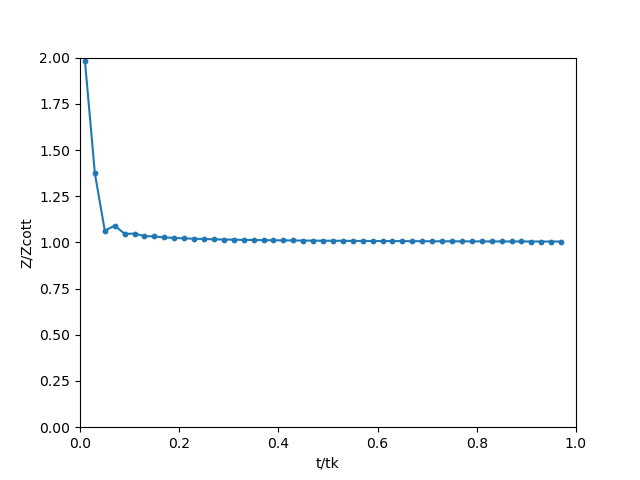
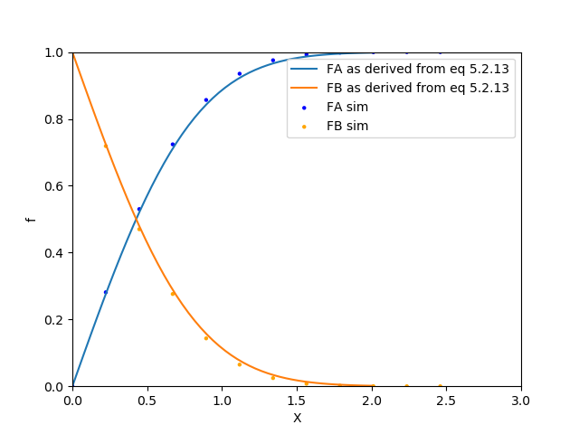

# Electrochemical Simulation of the Cottrell Experiment
This is This is a Python implementation of the FORTRAN program from Figure B.2.1 (Bard. 2001).
"An electro reactant A is uniformely distributed initially, but a potential step is applied at t = 0 to force the surface concentration of A to zero by converting it faradaically to Species B." (Bard, 2001)

## Example Use
```
# l = number of iterations corresponding to the known carachteristic time pf the simulation
# Dm = Model diffusion coefficient in a simulation (None)
# Boxes = How many boxes are to be plotted 
# tOVERtk = Non dimentional Time
```
```python CotSim.py --l 50 --Dm 0.4 --Boxes 12 --tOVERtk 0.2```


## Example Results


**Figure 1:** Simulation for Question B.2 from (Bard, 2001). Parameters l = 50 and Dm = 0.4. Simulated current parameter, Z, divided by analytical solution. Numbers by points are iteration numbers.




**Figure 2:** Simulation at t/tk = 0.2 for Question B.2 from (Bard, 2001). Concentration profiles from the simulation for l = 50, Dm = 0.4. Points are simulated; curves are analytical.

## Dependencies 
1. Install Python 3

1. Install required modules

	```pip install matplotlib```

	```pip install numpy```


## Reference
Bard, Allen J, and Larry R Faulkner. _Electrochemical Methods : Fundamentals and Applications. Second ed._, John Wiley & Sons, 2001.